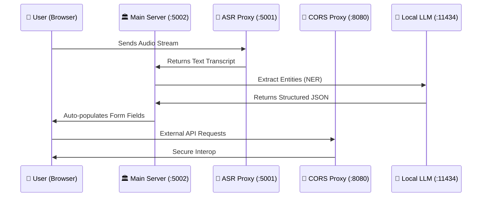

# ODR_MSME
# MSME-25: AI-Assisted Dispute Resolution Platform

[](#)
[](#)
[](#)

## 📖 Overview

**MSME-25** is a cutting-edge, automated dispute resolution platform designed to empower Micro, Small, and Medium Enterprises (MSMEs) in navigating the complexities of legal filings. By transforming the traditional, high-friction process of filing **Statements of Claim (SOC)** and **Statements of Defense (SOD)** into a streamlined, AI-guided conversational experience, we lower the barrier to justice for small businesses.

At its core, the platform leverages **Local LLMs (Ollama)** for data privacy and **Bhashini ASR** for multilingual inclusivity, ensuring that every entrepreneur can file a robust legal claim regardless of their technical or linguistic background.

---

## 🚀 Key Features

### 🎤 1. AI-Assisted Voice Filing
Experience a "Voice-to-Form" breakthrough. The platform breaks down dense 24+ field legal forms into manageable conversational "chunks."
- **Autonomous NER Extraction**: Extracts entities like Udyam numbers, PAN, GST, and amounts directly from natural speech.
- **Context-Aware Confirmation**: The assistant audibly confirms extracted data before advancing, ensuring 99%+ accuracy in the final filing.
- **Multilingual Support**: Supports 10+ Indian languages via deep Bhashini integration.

### ⚖️ 2. Digital Guided Pathway (DGP)
Our "Probability Engine" analyzes the strength of both SOC and SOD to provide:
- **Win/Loss Probability**: Algorithmic assessment based on evidence quality and legal merit.
- **Fair Settlement Range**: Suggested resolution amounts based on the MSMED Act (3x bank rate interest).
- **Executive Reasoning**: Clear, human-readable explanations of project strengths and weaknesses.

### 🤝 3. Virtual Negotiation Assistant
A client-side negotiation room powered by "Empathy" and "Mediation" engines.
- **AI-Guided Strategy**: Suggests counter-offers based on the DGP fair-range analysis.
- **Sentiment-Aware Responses**: Lowers the emotional friction between parties to facilitate faster settlements.
- **Automated Settlement Agreements**: Generates legally-templated documents upon mutual agreement.

### 📂 4. Intelligent Document Repository
A smart vault for evidence management.
- **Unified OCR Pipeline**: Uses LLaVA (Vision) and Qwen 2.5 (Instruct) to automatically extract data from uploaded invoices, POs, and Udyam certificates.
- **Auto-Populate**: Upload once, and the platform fills the form for you.

---

## 🏗️ System Architecture

MSME-25 operates on a distributed micro-architecture consisting of three core backend services to ensure scalability and cross-domain compatibility.



### Component Breakdown
- **MSEFC Main Server**: The hub for case logic, persistence (JSON/PostgreSQL), and AI orchestration.
- **Bhashini API Server**: Handles linguistic translation and high-accuracy Indian ASR (Automatic Speech Recognition).
- **CORS Proxy**: Ensures seamless communication with government endpoints and local LLM services.

---

## 💻 Technical Stack

- **Backend**: Python 3.13+, Flask
- **Frontend**: Vanilla HTML5, CSS3, JavaScript (ES6+)
- **AI/ML**: 
  - **Ollama**: Running `qwen2.5:7b-instruct` (NER/Logic) and `llava:7b` (Vision/OCR).
  - **Bhashini**: Multilingual ASR and Translation APIs.
- **Storage**: Lightweight JSON (Current), Architected for PostgreSQL/SQLite.

---

## 🛠️ Installation & Setup

### 1. Prerequisites
- **Python 3.13+** installed.
- **Ollama** installed and running.
- Pull the required models:
  ```bash
  ollama pull qwen2.5:7b-instruct
  ollama pull llava:7b
  ```

### 2. Environment Setup
```bash
git clone https://github.com/iamaryaman/msme-25.git
cd msme-25
source venv/bin/activate  # Or your preferred env manager
pip install -r requirements.txt
```

### 3. Running the Platform
#### macOS/Linux:
```bash
chmod +x run.command
./run.command
```
#### Windows:
```bash
run.bat
```
*This will automatically launch three terminal windows for the Main Server, Bhashini Proxy, and CORS Proxy.*

---

## 📂 Project Structure

```text
msme-25/
├── msefc_server.py         # Main Flask API Server
├── ai_assistant.py         # AI Logic, NER, & Prediction Engine
├── bhashini_api_server.py  # ASR & Translation Gateway
├── proxy_server.py         # CORS Bypass Utility
├── static/                 # Frontend Assets (JS, CSS, Images)
│   ├── msefc_dashboard.js  # Dashboard & Case Management
│   ├── filing.js           # Voice-assisted filing client
│   └── script.js           # Core UI logic
├── msefc_templates/        # HTML Templates
│   ├── msefc_index.html    # Main Landing Page
│   └── ...                 # Feature-specific pages
├── data/                   # Persistent storage (cases.json)
└── uploads/                # Evidence & Document storage
```

---

## 🛡️ Responsible AI & Compliance

- **Privacy-First**: By utilizing heavy local LLMs (`qwen2.5`), sensitive financial and legal data stays on-premise.
- **Accessibility**: Voice-first design ensures that the platform is usable for those with visual impairments or varying levels of digital literacy.
- **Accountability**: Every AI extraction is visually confirmed by the user, maintaining "Human-in-the-Loop" integrity.

---

## 📄 License
This project is developed for the **MSME Dispute Resolution Challenge**. 
© 2026 iamaryaman. Distributed under the MIT License.

